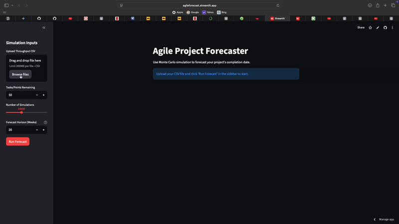

# 🚀 Agile Project Forecaster

A web app that uses Monte Carlo simulation to create probabilistic "burn-up" charts and forecast project completion dates.

This tool moves beyond simple "best-case/worst-case" estimates by running thousands of simulations based on your team's actual historical data.

## ☁️ Live Demo

**You can try the app live here:** (https://agileforecast.streamlit.app)



## 🚀 How to Use

1.  **Upload a CSV** of your team's past "throughput" (tasks completed per week). The file must have a single column named `throughput`.
2.  **Enter your inputs** in the sidebar:
    * **Tasks Remaining:** How many tasks/points are in your backlog.
    * **Number of Simulations:** 10,000 is a good start. More is more accurate.
    * **Forecast Horizon:** How many weeks into the future to simulate.
3.  **Click "Run Forecast"** to see the results.

## 📊 How to Read the Chart

* **Percentile Lines:** These show the probability of your team's progress. The **"85% Likelihood"** line means 85% of all simulations finished *at or better than* this path.
* **Cone of Uncertainty:** The shaded area shows the most probable range of outcomes.
* **Target Line:** This is your goal (the "Tasks Remaining").
* **The Forecast:** The metrics (e.g., "85% Likelihood: 12 Weeks") are calculated by finding where the percentile lines **cross your target line**.

  
## 🛠️ How to Run Locally

1.  Clone this repository.
2.  Install the required libraries:
    ```bash
    pip install -r requirements.txt
    ```
3.  Run the Streamlit app:
    ```bash
    streamlit run app.py
    ```

## 🏛️ Project Structure
* **`app.py`**: The Streamlit web interface (the "front-end").
* **`simulator.py`**: The back-end simulation "engine".
* **`requirements.txt`**: The list of Python dependencies.
* **`history.csv`**: Sample data to test the app.
